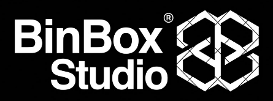

<div align="center">
  
  <br />
  
  # 📦 BinBox Studio 🚀

  **A dedicated Linux-style tiling workspace on Windows, built for modern developers and AI agents.**

  [](https://github.com/Harilowji/BinBox/releases/latest)
  [](https://github.com/Harilowji/BinBox/releases/latest)
  [](LICENSE)
  [-34d399?style=for-the-badge&logo=github&logoColor=white&labelColor=0d1527)](https://github.com/Harilowji)

  <br />

  <a href="#-download--installation">
    
  </a>
  <a href="https://github.com/Harilowji/BinBox/releases">
    
  </a>

  <br /><br />
</div>

<div align="center">
  <a href="assets/demo/tethys-demo.mp4">
    
  </a>
</div>

<div align="center">
  
</div>

## 📥 Download & Installation

BinBox Studio is available as a standalone desktop application for Windows 10 and Windows 11 (64-bit).

| Package | Format | Architecture | Download Link |
| :--- | :---: | :---: | :--- |
| **BinBox Studio Setup (Recommended)** | `.exe` | x64 | [**Download `BinBox.Studio_0.2.0_x64-setup.exe`**](https://github.com/Harilowji/BinBox/releases/latest/download/BinBox.Studio_0.2.0_x64-setup.exe) |
| **Windows MSI Installer** | `.msi` | x64 | [**Download `BinBox.Studio_0.2.0_x64_en-US.msi`**](https://github.com/Harilowji/BinBox/releases/latest/download/BinBox.Studio_0.2.0_x64_en-US.msi) |
| **All Releases & Release Notes** | Release Page | x64 | [**View GitHub Releases**](https://github.com/Harilowji/BinBox/releases) |

### ⚡ One-Liner Install via PowerShell:
You can download and launch the latest BinBox Studio installer directly using PowerShell:

```powershell
Invoke-WebRequest -Uri "https://github.com/Harilowji/BinBox/releases/latest/download/BinBox.Studio_0.2.0_x64-setup.exe" -OutFile "$env:TEMP\BinBoxStudio-Setup.exe"; Start-Process "$env:TEMP\BinBoxStudio-Setup.exe"
```

> **Requirements:**
> - **OS:** Windows 10 (version 1809+) or Windows 11 (64-bit).
> - **WebView2 Runtime:** Microsoft Edge WebView2 (preinstalled by default on all modern Windows 10/11 machines).
> - **Hardware:** Any modern x64 CPU, 4GB+ RAM.


## 💡 Why BinBox

**Coding with AI agents changes how we interact with our workspace.**

> When tools like `claude`, `codex`, `cursor`, or `aider` write code, modify specs, and run background jobs all at once, a standard terminal is no longer enough. On Windows, tracking these actions usually means endless Alt-Tabbing across editors, diff tools, and file explorers just to see what the agent changed.

<div align="center">
  
</div>

**BinBox brings the power and fluid tiling of a Linux desktop directly to Windows, combined with native AI Agent & Code Editing superpowers.**

> Terminal sessions, live code editor, markdown previews, image inspectors, web overlays, and git diffs live together on one responsive canvas. The instant an agent updates a file, it renders side by side in real time, keeping you completely in your flow without overlapping window clutter.


## ⚡ Highlights

<table>
  <tr>
    <td width="50%">
      <h3>🪟 Flexible Tiling Canvas</h3>
      <p>Split panels horizontally or vertically, drag to rearrange, and resize freely. Keep your agent output, editor, and tools in a single unified view.</p>
    </td>
    <td width="50%">
      <h3>✏️ Built-in Code Editor & Live Preview</h3>
      <p>Edit files directly with line numbers, syntax indentation, and <code>Ctrl+S</code> saving, or inspect markdown, images, and git diffs in real time.</p>
    </td>
  </tr>
  <tr>
    <td width="50%">
      <h3>🤖 Interactive AI Agent Assistant</h3>
      <p>Built-in AI Assistant panel supporting local Ollama or cloud LLMs. Generate code, save to files, and run commands in your terminal with 1 click.</p>
    </td>
    <td width="50%">
      <h3>🚀 Fast Hardware-Accelerated Terminal</h3>
      <p>WebGL hardware-accelerated terminal with crisp text, OSC 133 semantic command blocks, exit codes, and OSC 7 automatic working directory tracking.</p>
    </td>
  </tr>
  <tr>
    <td width="50%">
      <h3>📑 Multiple Workspaces</h3>
      <p>Keep independent project layouts running in parallel. Switch between dedicated workspaces smoothly using keyboard shortcuts (<code>Alt+1..9</code>).</p>
    </td>
    <td width="50%">
      <h3>🌐 Embedded Explorer & Native Web</h3>
      <p>Browse project directories, inspect local ports, and view web previews directly alongside your terminal sessions.</p>
    </td>
  </tr>
</table>


## ⌨️ Essential Shortcuts

| Shortcut | Action |
| :--- | :--- |
| <kbd>Ctrl</kbd> + <kbd>K</kbd> / <kbd>F1</kbd> | Open Command Palette |
| <kbd>Ctrl</kbd> + <kbd>T</kbd> / <kbd>Ctrl</kbd> + <kbd>W</kbd> | Open terminal / Close active panel |
| <kbd>Ctrl</kbd> + <kbd>Shift</kbd> + <kbd>E</kbd> / <kbd>O</kbd> | Split panel to the right / below |
| <kbd>Ctrl</kbd> + <kbd>Shift</kbd> + <kbd>D</kbd> | Duplicate active panel |
| <kbd>Ctrl</kbd> + <kbd>Tab</kbd> | Focus next tiled panel |
| <kbd>Ctrl</kbd> + <kbd>S</kbd> | Save changes in Code Editor |
| <kbd>Win</kbd> + <kbd>Arrow Keys</kbd> | Snap active panel |
| <kbd>Ctrl</kbd> + <kbd>1</kbd> / <kbd>Ctrl</kbd> + <kbd>3</kbd> | Switch to previous / next workspace |
| <kbd>Alt</kbd> + <kbd>1...9</kbd> | Jump to workspace 1 to 9 |
| <kbd>Ctrl</kbd> + <kbd>,</kbd> | Open Settings |
| <kbd>F11</kbd> | Toggle Fullscreen |


## 🛠️ Build from Source

<details>
<summary><b>Click to expand development instructions</b></summary>

<br />

### Prerequisites
- **Node.js**: v20 or higher
- **Rust**: Latest stable toolchain (`rustup`)
- **C++ Build Tools**: Microsoft Visual Studio 2022 C++ Build Tools (`MSVC`)

### Setup & Run

1. Clone the repository:
   ```bash
   git clone https://github.com/Harilowji/BinBox.git
   cd BinBox/app
   ```

2. Install dependencies:
   ```bash
   npm install
   ```

3. Run in development mode:
   ```bash
   npm run tauri dev
   ```

4. Build release executable & installer:
   ```bash
   npm run tauri build
   ```

The compiled binaries will be output to `app/src-tauri/target/release/bundle/`.

</details>

<br />

<div align="center">
  
  <br /><br />
  <b>BinBox</b> is open source software released under the <a href="LICENSE">MIT License</a>.
  <br />
  Crafted with passion by <b>Shadow (<a href="https://github.com/Harilowji">Harilowji</a>)</b>.
</div>
